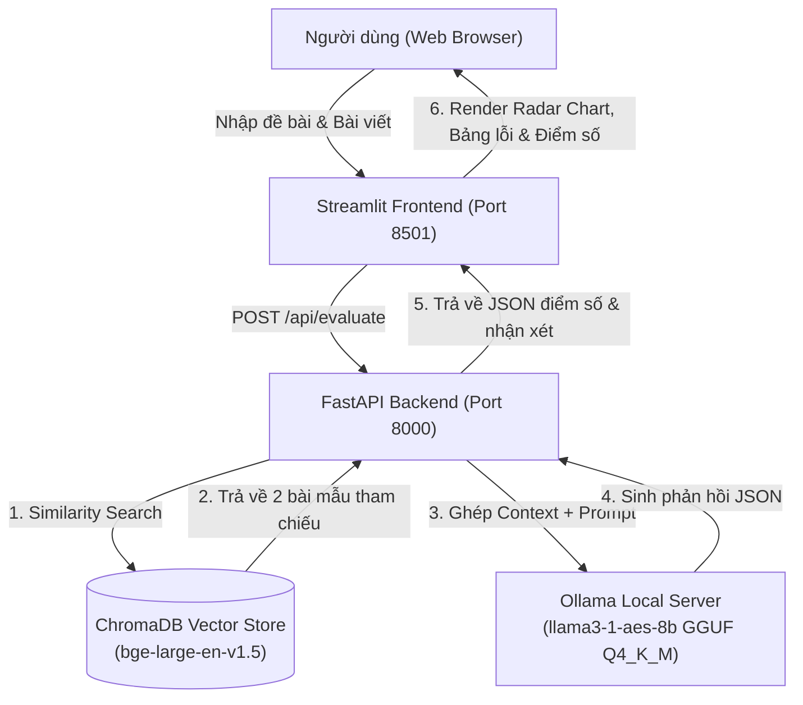

# AES-LLM: Automated IELTS Essay Scoring with Llama-3.1-8B (1-LoRA) & RAG

[](https://www.python.org/)
[](https://pytorch.org/)
[](https://fastapi.tiangolo.com/)
[](https://streamlit.io/)
[](https://ollama.com/)

**AES-LLM** là hệ thống chấm điểm bài viết IELTS Writing Task 2 tự động (Automated Essay Scoring) toàn diện, kết hợp mô hình ngôn ngữ lớn **Meta-Llama-3.1-8B-Instruct** được tinh chỉnh bằng kỹ thuật **1-LoRA (Multi-task Low-Rank Adaptation)** kết hợp cùng cơ chế **RAG (Retrieval-Augmented Generation)** và cơ sở dữ liệu vector **ChromaDB**.

---

## 🌟 Tính Năng Nổi Bật

1. **Chấm điểm chuẩn 4 tiêu chí IELTS Task 2:**
   * **Task Response (TR):** Đánh giá mức độ hoàn thành yêu cầu đề bài và phát triển lập luận.
   * **Coherence & Cohesion (CC):** Đánh giá tính mạch lạc, liên kết câu và cấu trúc phân đoạn.
   * **Lexical Resource (LR):** Phân tích vốn từ vựng, chỉ ra các lỗi dùng từ và đề xuất cách sửa (Corrections).
   * **Grammatical Range & Accuracy (GRA):** Phân tích độ đa dạng ngữ pháp, trích xuất lỗi sai ngữ pháp kèm sửa lỗi chi tiết.
   * **Overall Band Score:** Điểm tổng hợp được làm tròn chuẩn theo quy tắc IELTS (bước nhảy 0.5 band).
2. **Ngữ cảnh tham chiếu RAG Đa dạng (Diversity Retrieval):**
   * Sử dụng mô hình embedding `BAAI/bge-large-en-v1.5` trên ChromaDB.
   * Truy xuất tự động 2 bài viết tham chiếu tương đồng nhất (1 bài neo cận dưới, 1 bài neo cận trên) kèm cơ chế lọc chống rò rỉ mục tiêu (`Target Leakage Prevention`).
3. **Định dạng đầu ra JSON nghiêm ngặt (Strict JSON Formatting):**
   * Kết quả trả về dạng JSON có cấu trúc chuẩn, phục vụ tích hợp API và vẽ biểu đồ trực quan.
4. **Triển khai Cục bộ Hiệu năng Cao (Edge/Local Deployment):**
   * Mô hình được lượng hóa 4-bit (GGUF Q4_K_M) chạy mượt mà trên phần cứng phổ thông thông qua **Ollama Server**.
   * Hệ thống phân tách rõ ràng giữa **FastAPI Backend (Port 8000)** và **Streamlit Web UI (Port 8501)**.

---

## 🏗 Kiến Trúc Hệ Thống



---

## 📁 Cấu Trúc Thư Mục Dự Án

```text
AES_LLM/
├── data/
│   ├── raw/                           # Dữ liệu IELTS thô
│   └── processed/                     # Dữ liệu đã làm sạch & phân chia train/val/test
│       ├── chroma_db/                 # Cơ sở dữ liệu Vector RAG lưu trữ cục bộ
│       ├── train.csv
│       ├── val.csv
│       ├── test.csv
│       └── rag_knowledge_base.csv
├── notebooks/                         # Quy trình thực nghiệm 4 giai đoạn
│   ├── 1_exploratory_data_analysis.ipynb    # Phân tích khám phá dữ liệu (EDA)
│   ├── 2_data_cleaning.ipynb                # Tiền xử lý & làm sạch văn bản
│   ├── 3_dataset_splitting.ipynb            # Phân tách tập dữ liệu (Stratified Split)
│   ├── 4_data_quality_check.ipynb           # Kiểm định chất lượng dữ liệu
│   ├── 5_rag_setup.ipynb                    # Xây dựng Vector DB với ChromaDB
│   ├── 6_rag_test.ipynb                     # Kiểm thử truy xuất RAG
│   ├── 7_rag_prompt_engineering.ipynb       # Tối ưu hóa cấu trúc prompt RAG
│   ├── 8_lora_finetuning.ipynb              # Huấn luyện SFT 1-LoRA (Local)
│   ├── 8_colab_lora_finetuning.ipynb        # Huấn luyện SFT 1-LoRA (Google Colab)
│   ├── 9_model_merge.ipynb                  # Hợp nhất LoRA Adapter & xuất GGUF
│   ├── 10_inference_test.ipynb              # Thử nghiệm suy luận cục bộ
│   └── 11_model_evaluation.ipynb           # Đánh giá định lượng học thuật (QWK, MAE)
├── src/
│   ├── api/
│   │   ├── __init__.py
│   │   └── app.py                     # Máy chủ RESTful API (FastAPI)
│   └── rag/
│       ├── __init__.py
│       └── rag_utils.py               # Thư viện xử lý RAG, VectorDB & Prompt Template
├── scripts/
│   ├── data_utils.py                  # Tiện ích tiền xử lý dữ liệu
│   ├── run_data_preprocessing.py      # Script tự động hóa toàn bộ Giai đoạn 1
│   ├── create_paper_doc.py            # Tạo báo cáo khoa học định dạng Word
│   └── web_app.py                     # Giao diện người dùng Web App (Streamlit)
├── Modelfile                          # Cấu hình nạp mô hình GGUF vào Ollama
├── requirements.txt                   # Danh sách thư viện phụ thuộc
├── Bao_cao_Ke_hoach_AES_LLM.md        # Báo cáo kỹ thuật & kế hoạch cải tiến
├── RUN_GUIDE.md                       # Hướng dẫn chi tiết từng bước vận hành
└── README.md                          # Tài liệu tổng quan dự án
```

---

## Hướng Dẫn Cài Đặt & Chạy Demo

### 1. Thiết lập Môi trường ảo & Cài đặt Thư viện

```bash
# 1. Di chuyển vào thư mục dự án
cd "T:\5 - Summer 2026\AES_LLM"

# 2. Khởi tạo môi trường ảo Python 3.10
python -m venv .venv

# 3. Kích hoạt môi trường ảo
# Trên Windows PowerShell:
.venv\Scripts\Activate.ps1
# Hoặc trên Windows Command Prompt:
.venv\Scripts\activate.bat

# 4. Cài đặt PyTorch CUDA và các thư viện cần thiết
pip install torch torchvision torchaudio --index-url https://download.pytorch.org/whl/cu124
pip install -r requirements.txt
pip install fastapi uvicorn httpx pydantic streamlit
```

### 2. Thiết lập Mô hình Ollama Local

Đảm bảo bạn đã có tệp trọng số GGUF (được tạo ra sau bước `notebooks/9_model_merge.ipynb`) và đã cài đặt [Ollama](https://ollama.com/):

```bash
# Tạo mô hình trên Ollama từ Modelfile
ollama create llama3-1-aes-8b -f Modelfile

# Kiểm tra mô hình
ollama run llama3-1-aes-8b
```

### 3. Khởi động Hệ thống Demo (2 Bước)

#### Bước 1: Khởi động Backend API (FastAPI)
Mở một cửa sổ Terminal, kích hoạt `.venv` và chạy:
```bash
python src/api/app.py
```
* API Server sẽ chạy tại: `http://127.0.0.1:8000`
* Swagger UI Docs tương tác: `http://127.0.0.1:8000/docs`

#### Bước 2: Khởi động Giao diện Web (Streamlit UI)
Mở một cửa sổ Terminal thứ hai, kích hoạt `.venv` và chạy:
```bash
streamlit run scripts/web_app.py
```
* Giao diện Web sẽ tự động mở tại: `http://localhost:8501`

---

## Kết Quả Đánh Giá Thực Nghiệm (Evaluation)

Hệ thống được đánh giá định lượng trên tập kiểm thử độc lập (`data/processed/test.csv`) thông qua notebook `notebooks/11_model_evaluation.ipynb`:

| Tiêu chí Đánh giá | Quadratic Weighted Kappa (QWK) (↑) | Mean Absolute Error (MAE) (↓) |
| :--- | :---: | :---: |
| **Task Response (TR)** | 0.1909 | 1.5667 |
| **Coherence & Cohesion (CC)** | 0.1751 | 1.7500 |
| **Lexical Resource (LR)** | 0.2216 | 1.5500 |
| **Grammatical Range & Accuracy (GRA)** | 0.1456 | 1.7000 |
| **Overall Band Score** | **0.1726** | **1.6000** |

> **Phân tích hiện trạng & Điểm nghẽn:**
> Mặc dù hệ thống đã khắc phục hoàn toàn lỗi rò rỉ dữ liệu (Target Leakage) và lỗi cấu trúc JSON, mô hình hiện tại vẫn gặp hiện tượng **Under-scoring & Score Compression** (nén dải điểm trong khoảng 3.5 - 5.5 và chưa chấm được bài $\ge 7.0$).

---

## 🛠 Lộ Trình Cải Tiến Tương Lai

1. **Data Re-balancing & CoT (Chain-of-Thought):**
   * Cân bằng phân phối tập train (Oversampling bài band cao 6.5 - 8.5).
   * Bổ sung trường suy luận giải thích (`Reasoning_Justification`) chi tiết trước khi chốt điểm.
2. **Anchor RAG & IELTS Rubric Alignment:**
   * Nạp trực tiếp tóm tắt IELTS Public Band Descriptors vào System Prompt làm thang đo cứng.
   * Cố định cặp bài mẫu cận trên/cận dưới trong RAG Context.
3. **Mục tiêu huấn luyện DPO (Direct Preference Optimization):**
   * Huấn luyện so sánh cặp (Pairwise Ranking Loss) để tối ưu hóa thứ bậc điểm số giữa các bài luận.
4. **Score Calibration Hậu xử lý:**
   * Cân chỉnh phân phối điểm bằng hồi quy Isotonic/Linear Regression trên tập Validation.

---